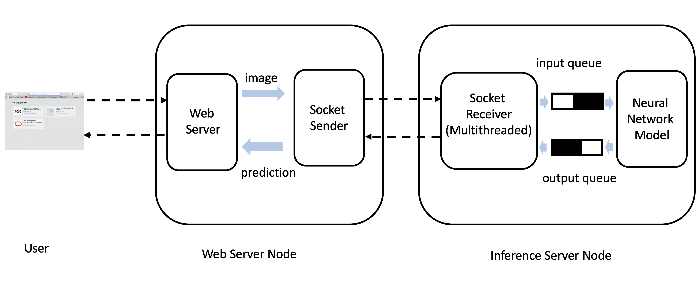
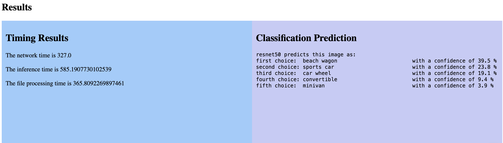

# Image Classification Application on GENI Network via Socket Programming.




# 0. Demo

Open your browser and visit

```bash
http://198.248.248.136:8080/Image-App/
```

Upload your image (size < 1MB, tested with .jpg).





# 1. Setup Inference Server


## Step 1 Reserve Geni Slice

Create a geni slice using the rspec in GitHub repo: *fin_request_rspec.xml* 

Log into the node called Infer.


## Step 2 Setup requirements

```bash
git clone https://github.com/TTTheo/Image-Recognition-Application.git
```

```bash
cd Image-Recognition-Application/NNServer/
```

```bash
bash setup_server.sh
```

```bash
source ~/.bashrc
```

Test whether java is install correctly:

```bash
java -version
>> penjdk version "13.0.1" 2019-10-15
>> OpenJDK Runtime Environment (build 13.0.1+9)
>> OpenJDK 64-Bit Server VM (build 13.0.1+9, mixed mode, sharing)

javac -version
>> javac 13.0.1
```

Test whether conda and python is installed correctly:

```bash
conda --version
>> conda 4.8.0

python --version
>> Python 3.7.4
```


## Step 3 Run Server

Move to the inference server directory:

```bash
cd Image-Recognition-Application/NNServer/
```

Make temporary folders for input and output queues:

```bash
mkdir input
mkdir output
```


Compile java code:

```bash
javac InferenceServer.java
```

Run the socket server to listen to incomming connections

```bash
nohup java InferenceServer 8888 &
```

Press enter to get back the terminal prompt.


Run the neural network model with ResNet50:

```bash
nohup python RunInfer.py 50 &
```

Press enter to get back the terminal prompt. If it is your first time running it, you should wait for 1-2 minutes while the script is downloading the trained model.


Now the the inference server should be up running and listening to incomming connections and ready to run the nerual network model to recognize images. The public IP address of the server could be found using `ifconfig` command (which is required at the web server to connect to the inference server).

When you are finished you should kill both java and python because they should be starting and running at the same time.

```vi nohup.out
killall python
killall java
```


# 2. Setup Web Server


## Step 1 Enter Web Server Node

Log into the node called Web


## Step 2 Setup requirements

Install Java:

```bash
sudo su
wget https://raw.githubusercontent.com/TTTheo/Image-Recognition-Application/master/Java-steup.sh
bash Java-steup.sh
echo 'export JAVA_HOME=~/java/jdk-13.0.1' >> ~/.bashrc 
echo 'export PATH=$JAVA_HOME/bin:$PATH' >> ~/.bashrc 
source ~/.bashrc
```

Test whether java is install correctly:

```bash
java -version
>> penjdk version "13.0.1" 2019-10-15
>> OpenJDK Runtime Environment (build 13.0.1+9)
>> OpenJDK 64-Bit Server VM (build 13.0.1+9, mixed mode, sharing)

javac -version
>> javac 13.0.1
```


Install TomCat

```bash
wget https://raw.githubusercontent.com/TTTheo/Image-Recognition-Application/master/Tomcat-setup.sh
bash Tomcat-setup.sh

bash tomcat/apache-tomcat-9.0.29/bin/startup.sh

sudo mv tomcat/manager.xml tomcat/apache-tomcat-9.0.29/conf/Catalina/localhost/
sudo mv tomcat/tomcat-users.xml tomcat/apache-tomcat-9.0.29/conf/

exit
```


## Step 3 Run Server

Download GitHub repo which contains teh WAR file we need to set up the web server:

```bash
git clone https://github.com/TTTheo/Image-Recognition-Application.git
```


Get the routable-IP of web server node and visit the webpage:

```bash
http://Routable-IP:8080/manager/html
```

Login with username: admin and password: 123

Deploy -> Deploy directory or WAR file located on server
WAR or Directory path: 

```bash
/users/peilun/Image-Recognition-Application/FileUpload/target/Image-App.war
```

Click `Deloy`


Finally visit:

```bash
Then visit http://Routable-IP:8080/Image-App
```

